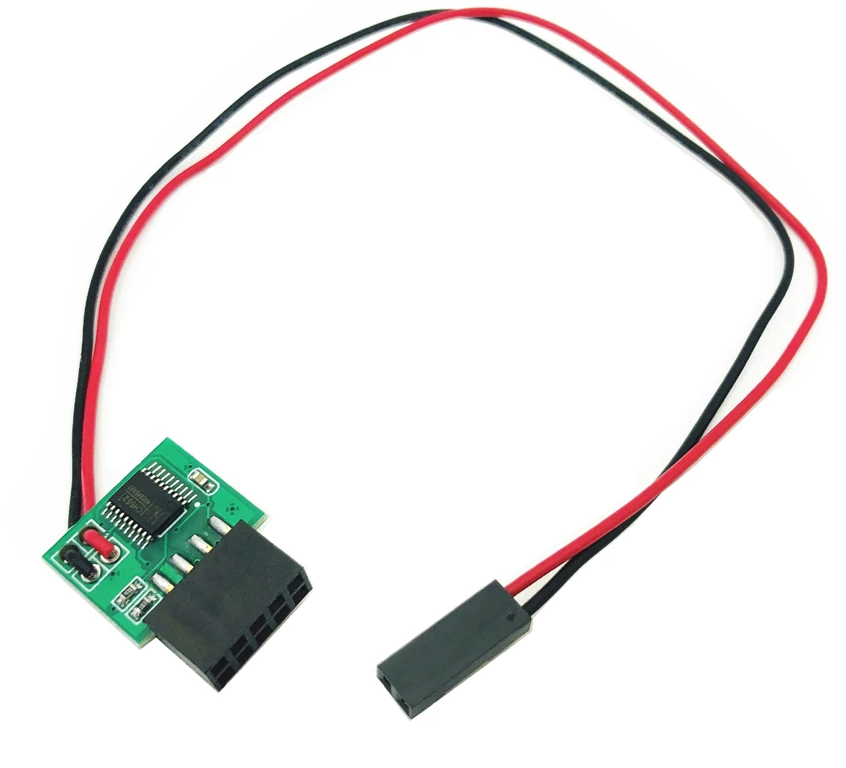

# Linux info for cheap internal USB watchdog



## How it works

This device plugs into a computer via an internal USB header and acts as a USB HID device. It seems to accept timeout value in hex and if the timeout occurs (system crashes and it does not receive timeout reset in time), it shorts two wires which should be connected to the motherboard's reset pins essentially "pressing" reset button and restarting the system.

## (Re)setting timeout

The easiest way is to write hex value to hid device using printf. According to information online, value 1E should cause a timeout in 5 minutes (0x1E is 30 in decimal and the device should multiply it internally by 10 seconds, so 30 * 10 seconds = 300 seconds = 5 minutes), but my observed timeout is about 2 minutes. It seems like my device has a different timeout implementation: number 10 (in hex) is about 58 seconds and number 11 (in hex) is about 62 seconds, so timeout in minutes should be multiplied by 11 hex, ~5 minute timeout should be 0x55.

Example of timeout reset command:

```bash
printf '\x55\x00' > /dev/hidraw0
```

## Using it with systemd

Copy files and enable service and timer

```bash
sudo cp watchdog-restart.service /etc/systemd/system
sudo cp watchdog-restart.timer /etc/systemd/system

sudo systemctl enable --now watchdog-restart.service
sudo systemctl enable --now watchdog-restart.timer
```

Now check if the timer is running

```bash
sudo systemctl list-timers
```

### Using it with cron or anything else (untested)

Add a cron job for user root with command `printf '\x55\x00' > /dev/hidraw0`
